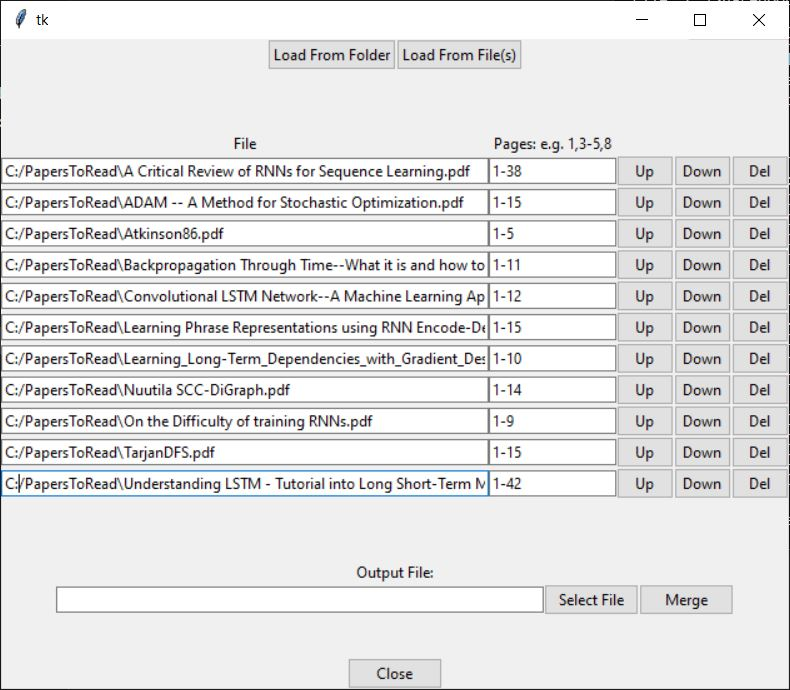

# PDF_sam
PDF split and merge UI

## Install:
from command line:
```
>git clone https://github.com/bondeje/PDF_sam.git
>cd PDF_sam
\PDF_sam>git submodule init
\PDF_sam>git submodule update
```

## Usage:
from command line:
```
\PDF_sam>python pdf_samp.py
```

loading files from a folder:

